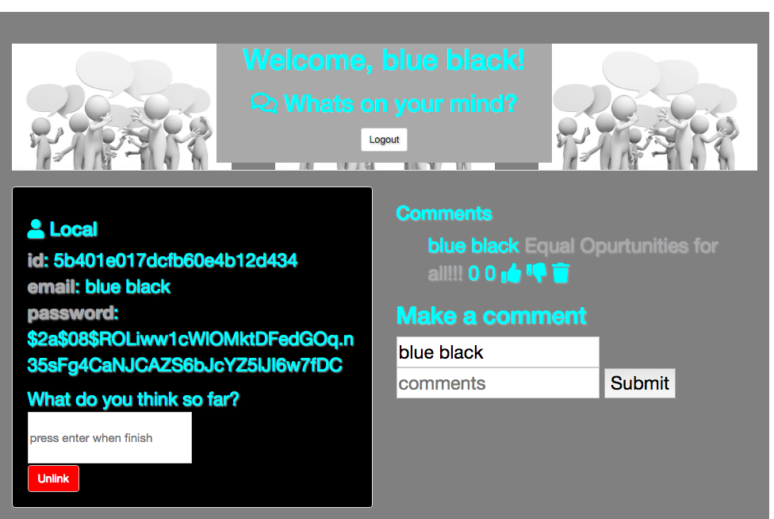

# Abit About A lot
  An Express application with user authorization and login using MongoDb.

## How It's Made:

**Tech used:** HTML, CSS, JavaScript, Express, MongoDB

This was my second attempt at making an Express application with user authorization. I created paths for users to create reviews to be added on the homescreen before logging in or signing up. I saved all the data to a online MongoDB and retreived and posted it where I wanted like the comments section, homepage, etc. I styled it to look more professional and clean rather than just anything anywhere. I also scrabbled the passwords in case of the database ever being hacked(even tho there is nothing to see there.) hope this may come in handy with any of your endeavors.

## Lessons Learned:

I learned new ways of creating endpoints and pathways for gathering the information i wanted and showing it where I wanted.
